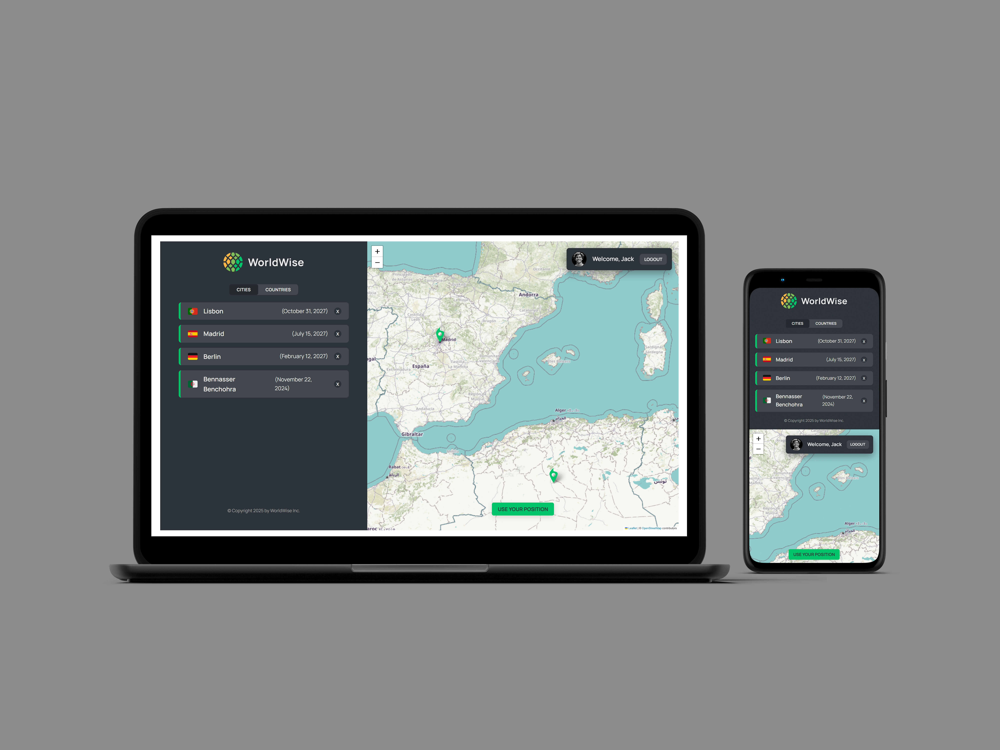

# **WorldWise: A Travel Tracking App**

## **Table of content:**

-   [Description](#description)
-   [Key Features](#key-features)
-   [Project Structure](#project-structure)
-   [Technical Highlights](#technical-highlights)
-   [Conclusion](#conclusion)

**Live demo** [click here](https://worldwise-travel-tracking-app.netlify.app/)



---

### **Description:**

WorldWise is a React-based single-page application that helps users track their travel adventures. It features a world map interface where users can select cities they’ve visited, add personal notes about their trips, and visualize all their traveled locations. The app is designed to keep memories alive and showcase the user's global wanderings in a clean and organized way.

---

### **Key Features:**

1. **Interactive Map:**

    - Users can click on the map to select cities they’ve visited.
    - Add notes and details about each trip for future reference.

2. **Travel Dashboard:**

    - Displays a list of all visited cities along with their corresponding countries.
    - Clean and organized view of travel history.

3. **User-Friendly Navigation:**

    - A single-page application with a well-structured navigation system.
    - Includes key pages like Home, Login, Pricing, Product, and the Travel Tracking page.

4. **Country Overview:**

    - Automatically aggregates and displays visited countries based on the selected cities.

5. **Authentication Simulation:**

    - Basic login functionality using a fake authentication context.
    - Simulates user login for access to the travel tracking features.

6. **Responsive and Modular Design:**
    - CSS Modules for a scoped and maintainable styling solution.

---

### **Project Structure:**

```
- data
  - cities.json          # Sample data for cities and countries
- index.html             # Root HTML file
- package-lock.json
- package.json
- public
- README.md
- src
  ├── App.jsx            # Main application component
  ├── components         # Reusable UI components
  │   ├── AppNav.jsx
  │   ├── BackButton.jsx
  │   ├── Button.jsx
  │   ├── City.jsx
  │   ├── CityItem.jsx
  │   ├── CityList.jsx
  │   ├── CountryItem.jsx
  │   ├── CountryList.jsx
  │   ├── Footer.jsx
  │   ├── Form.jsx
  │   ├── Logo.jsx
  │   ├── Map.jsx
  │   ├── Message.jsx
  │   ├── PageNav.jsx
  │   ├── Sidebar.jsx
  │   ├── Spinner.jsx
  │   ├── SpinnerFullPage.jsx
  │   ├── User.jsx
  │   ├── *.module.css    # CSS Modules for component styles
  ├── contexts           # Context API for global state management
  │   ├── CitiesContext.jsx
  │   ├── FakeAuthContext.jsx
  ├── hooks              # Custom hooks for reusable logic
  │   ├── useGeoLocation.js
  │   ├── useUrlPosition.js
  ├── index.css          # Global CSS styles
  ├── main.jsx           # Application entry point
  ├── pages              # Page components for routing
  │   ├── AppLayout.jsx
  │   ├── Homepage.jsx
  │   ├── Login.jsx
  │   ├── PageNotFound.jsx
  │   ├── Pricing.jsx
  │   ├── Product.jsx
  │   ├── ProtectedRoute.jsx
```

---

### **Technologies Used:**

1. **React.js:** Framework for building the user interface.
2. **React Router:** Manages navigation across pages within the single-page application.
3. **Context API:** Handles global state for cities and authentication.
4. **CSS Modules:** Ensures modular and maintainable component-specific styles.
5. **Custom Hooks:** Implements reusable logic for geolocation (`useGeoLocation`) and URL position tracking (`useUrlPosition`).

---

### **Conclusion:**

WorldWise is an intuitive and interactive travel tracking app that leverages modern web technologies like React, React Router, and the Context API. Its clean interface, dynamic map functionality, and modular design make it a valuable tool for travelers to preserve and showcase their global adventures.
